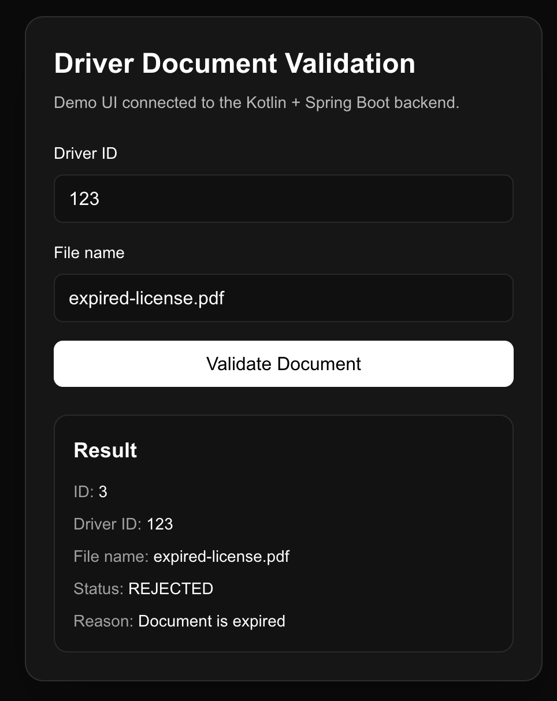
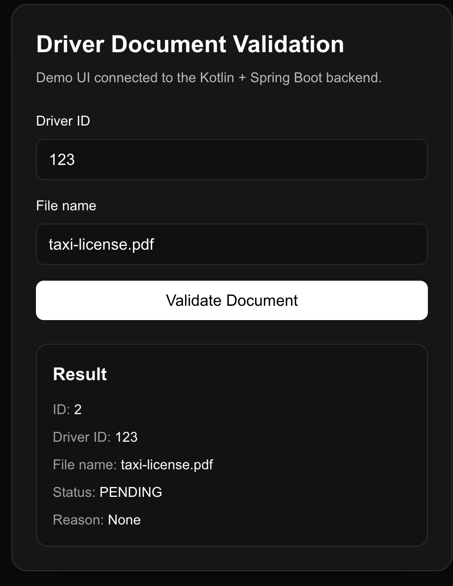

# Driver Validation API

Proof of concept Kotlin and Spring Boot API for driver document validation.

## What it does

This project simulates a small backend service for driver document validation.

It includes:

* health check endpoint
* driver document validation endpoint
* simple business rule to reject expired documents
* H2 in-memory database persistence
* Spring Data JPA repository layer
* clean package structure with controller, service, model, and repository layers

## Tech stack

* Kotlin
* Spring Boot
* Spring Data JPA
* H2 Database
* Gradle

## Endpoints

### Health check

`GET /api/health`

Response:

```
Driver Validation API is running
```

### Driver documents

`GET /api/driver-documents?driverId=123&fileName=taxi-license.pdf`

Example response:

```
{
  "id": 1,
  "driverId": "123",
  "fileName": "taxi-license.pdf",
  "status": "PENDING",
  "rejectionReason": null
}
```

Rejected example:

`GET /api/driver-documents?driverId=123&fileName=expired-license.pdf`

```
{
  "id": 2,
  "driverId": "123",
  "fileName": "expired-license.pdf",
  "status": "REJECTED",
  "rejectionReason": "Document is expired"
}
```

## Business rule

If the file name contains `expired`, the document is marked as `REJECTED`.

Otherwise, the document is marked as `PENDING`.

## Database

This project uses an H2 in-memory database so it can be reviewed and run locally without external database setup.

The API persists driver document records including:

* generated id
* driver id
* file name
* document status
* rejection reason

## Demo screenshots

### Frontend demo rejected document



### Frontend demo pending document



### H2 console login


### H2 console opened


### H2 persisted record


## Run locally

```
./gradlew bootRun
```

Open:

* API: `http://localhost:8080/api/health`
* H2 console: `http://localhost:8080/h2-console`

## H2 console settings

* JDBC URL: `jdbc:h2:mem:testdb`
* Username: `sa`
* Password: leave blank


