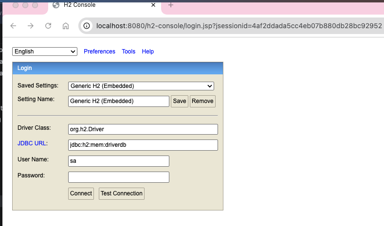
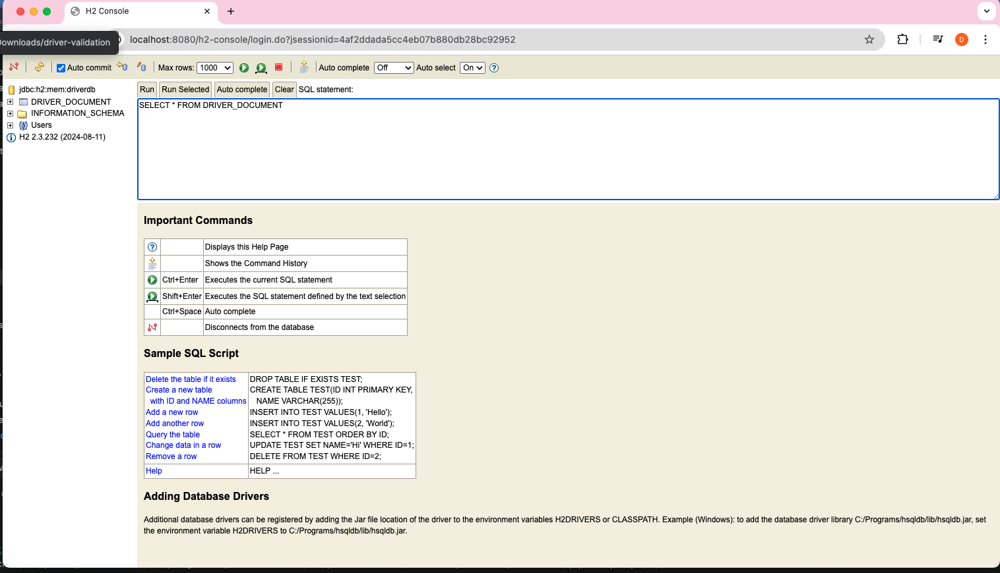

# Driver Validation API

Proof of concept Kotlin Spring Boot API and Next.js frontend for driver document validation.

## What it does

This project simulates a small driver document validation system with:

* Spring Boot backend API
* Next.js frontend UI
* simple business rule to reject expired documents
* H2 in-memory database persistence
* Spring Data JPA repository layer
* clean package structure for controller, service, model, and repository layers

## Tech stack

### Backend

* Kotlin
* Spring Boot
* Spring Data JPA
* H2 Database
* Gradle

### Frontend

* Next.js
* TypeScript
* React

## Project structure

* `src/` — Spring Boot backend
* `frontend/` — Next.js frontend
* `screenshots/` — demo screenshots

## Endpoints

### Health check

`GET /api/health`

Response:

```
Driver Validation API is running
```

### Driver documents

`GET /api/driver-documents?driverId=123&fileName=taxi-license.pdf`

Example response:

```
{
  "id": 1,
  "driverId": "123",
  "fileName": "taxi-license.pdf",
  "status": "PENDING",
  "rejectionReason": null
}
```

Rejected example:

`GET /api/driver-documents?driverId=123&fileName=expired-license.pdf`

```
{
  "id": 2,
  "driverId": "123",
  "fileName": "expired-license.pdf",
  "status": "REJECTED",
  "rejectionReason": "Document is expired"
}
```

## Business rule

If the file name contains `expired`, the document is marked as `REJECTED`.

Otherwise, the document is marked as `PENDING`.

## Database

This project uses an H2 in-memory database so it can be reviewed and run locally without external database setup.

The API persists driver document records including:

* generated id
* driver id
* file name
* document status
* rejection reason

## Demo screenshots

### Frontend demo rejected document


### Frontend demo pending document


### H2 console login


### H2 console opened



### H2 persisted record



## Run locally

### Backend

From the project root:

```
./gradlew bootRun
```

Backend runs on:

```
http://localhost:8080
```

Health check:

```
http://localhost:8080/api/health
```

H2 console:

```
http://localhost:8080/h2-console
```

### Frontend

From the `frontend` folder:

```
npm install
npm run dev
```

Frontend runs on:

```
http://localhost:3000
```

## H2 console settings

* JDBC URL: `jdbc:h2:mem:testdb`
* Username: `sa`
* Password: leave blank

## Example test cases

Use these values in the frontend form:

Pending example:

* Driver ID: `123`
* File name: `taxi-license.pdf`

Rejected example:

* Driver ID: `123`
* File name: `expired-license.pdf`


